# Database ERD

Generated from PostgreSQL database: `pgadmin4`

```mermaid
erDiagram
  actor {
    integer actor_id "PK, required"
    varchar actor_name "required"
  }

  admins {
    integer admin_id "PK, required"
    varchar username "required"
    varchar email "required"
    varchar password "required"
    timestamp_without_time_zone created_at "nullable"
  }

  author {
    integer author_id "PK, required"
    varchar author_name "required"
  }

  cart {
    integer cart_id "PK, required"
    integer user_id "FK, required"
    timestamp_without_time_zone created_at "nullable"
    timestamp_without_time_zone updated_at "nullable"
  }

  cart_movies {
    integer cart_id "PK, FK, required"
    integer movie_id "PK, FK, required"
  }

  genre {
    integer genre_id "PK, required"
    varchar genre_name "required"
  }

  library {
    integer library_id "PK, required"
    integer user_id "FK, required"
    integer movie_id "FK, required"
    boolean favorite "required"
  }

  movie_actor {
    integer movie_id "PK, FK, required"
    integer actor_id "PK, FK, required"
  }

  movie_author {
    integer movie_id "PK, FK, required"
    integer author_id "PK, FK, required"
  }

  movie_genre {
    integer movie_id "PK, FK, required"
    integer genre_id "PK, FK, required"
  }

  movies {
    integer movie_id "PK, required"
    varchar movie_name "required"
    numeric movie_cost "required"
    integer movie_rating "nullable"
    date movie_releasedate "required"
    text movie_poster "required"
    text detail "required"
    text video_url "nullable"
    text movie_status "required"
    timestamp_without_time_zone screening_expires_at "nullable"
  }

  payment {
    integer payment_id "PK, required"
    integer user_id "FK, required"
    integer cart_id "FK, required"
    numeric amount "required"
    text qr_ref "nullable"
    integer status "required"
    timestamp_without_time_zone payment_date "nullable"
    timestamp_without_time_zone expired_at "required"
    timestamp_without_time_zone completed_at "nullable"
    integer slip_id "FK, nullable"
  }

  playlist {
    integer playlist_id "PK, required"
    varchar playlist_name "nullable"
    integer library_id "FK, nullable"
  }

  playlist_movie {
    integer playlist_id "PK, FK, required"
    integer movie_id "PK, FK, required"
    integer sort_order "nullable"
  }

  report_review {
    integer reporter_id "PK, FK, required"
    integer review_id "PK, FK, required"
    timestamp_without_time_zone report_date "required"
    integer status "required"
    text reason "required"
  }

  review {
    integer review_id "PK, required"
    integer user_id "FK, required"
    integer movie_id "FK, required"
    integer review_number "required"
    numeric rating "required"
    varchar comment "nullable"
    timestamp_without_time_zone date_review "required"
  }

  transfer_slip {
    integer slip_id "PK, required"
    integer user_id "FK, required"
    text slip_image "required"
    numeric amount "required"
    timestamp_without_time_zone uploaded_at "nullable"
  }

  users {
    integer user_id "PK, required"
    varchar username "required"
    varchar email "required"
    varchar telephone "required"
    text password "required"
    timestamp_without_time_zone register_date "nullable"
  }

  users ||--o{ cart : "user_id"
  cart ||--o{ cart_movies : "cart_id"
  movies ||--o{ cart_movies : "movie_id"
  movies ||--o{ library : "movie_id"
  users ||--o{ library : "user_id"
  actor ||--o{ movie_actor : "actor_id"
  movies ||--o{ movie_actor : "movie_id"
  author ||--o{ movie_author : "author_id"
  movies ||--o{ movie_author : "movie_id"
  genre ||--o{ movie_genre : "genre_id"
  movies ||--o{ movie_genre : "movie_id"
  cart ||--o{ payment : "cart_id"
  transfer_slip ||--o{ payment : "slip_id"
  users ||--o{ payment : "user_id"
  library ||--o{ playlist : "library_id"
  movies ||--o{ playlist_movie : "movie_id"
  playlist ||--o{ playlist_movie : "playlist_id"
  users ||--o{ report_review : "reporter_id"
  review ||--o{ report_review : "review_id"
  movies ||--o{ review : "movie_id"
  users ||--o{ review : "user_id"
  users ||--o{ transfer_slip : "user_id"
```

## Relationships

- `cart.user_id` references `users.user_id` (CASCADE)
- `cart_movies.cart_id` references `cart.cart_id` (CASCADE)
- `cart_movies.movie_id` references `movies.movie_id` (CASCADE)
- `library.movie_id` references `movies.movie_id` (CASCADE)
- `library.user_id` references `users.user_id` (CASCADE)
- `movie_actor.actor_id` references `actor.actor_id` (CASCADE)
- `movie_actor.movie_id` references `movies.movie_id` (CASCADE)
- `movie_author.author_id` references `author.author_id` (CASCADE)
- `movie_author.movie_id` references `movies.movie_id` (CASCADE)
- `movie_genre.genre_id` references `genre.genre_id` (CASCADE)
- `movie_genre.movie_id` references `movies.movie_id` (CASCADE)
- `payment.cart_id` references `cart.cart_id` (CASCADE)
- `payment.slip_id` references `transfer_slip.slip_id` (SET NULL)
- `payment.user_id` references `users.user_id` (CASCADE)
- `playlist.library_id` references `library.library_id` (CASCADE)
- `playlist_movie.movie_id` references `movies.movie_id` (CASCADE)
- `playlist_movie.playlist_id` references `playlist.playlist_id` (CASCADE)
- `report_review.reporter_id` references `users.user_id` (CASCADE)
- `report_review.review_id` references `review.review_id` (CASCADE)
- `review.movie_id` references `movies.movie_id` (CASCADE)
- `review.user_id` references `users.user_id` (CASCADE)
- `transfer_slip.user_id` references `users.user_id` (NO ACTION)
